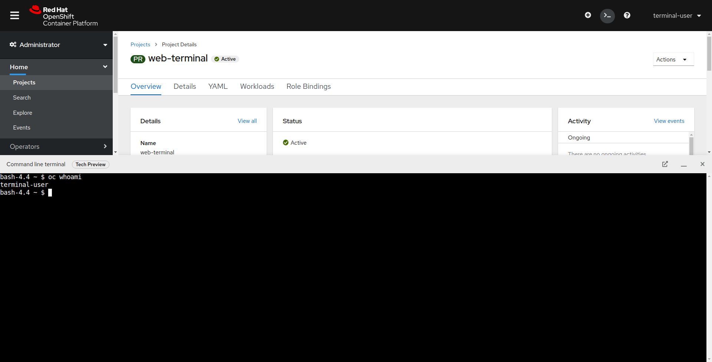
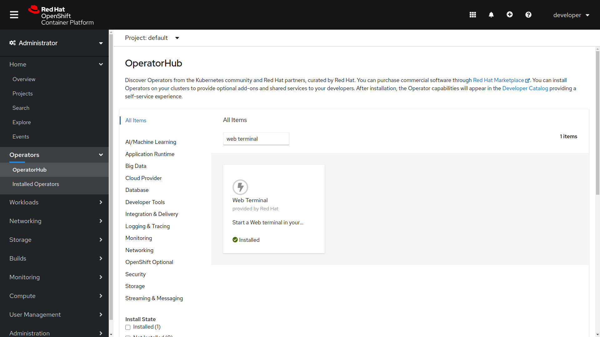

# Table of Contents

- [Introduction](#Introduction)
- [How to use](#how-to-use)
- [Installation](#Installation)
- [Uninstalling](#Uninstalling)
- [FAQ](#FAQ)

# Introduction

The Web Terminal Operator allows you to start a terminal inside of your browser with common CLI tools for interacting with the cluster.

**Note:** The OpenShift console integration that allows easily creating web terminal instances
and logging in automatically is available in OpenShift 4.5.3 and higher. In previous versions of
OpenShift, the operator can be installed but web terminals will have to be created and accessed
manually.

# How to use

After installing the Web Terminal operator, you can use the web terminal by first clicking on the terminal button in the top right of the OpenShift console

This will open up a web terminal at the bottom of your screen. This terminal will automatically be logged in as your OpenShift user and have tools like `oc`, `kubectl`, ODO, Knative, Tekton, Helm, `kubens`, and `kubectx` pre-installed. 

# Installation

The Web Terminal can be installed via OperatorHub on Openshift Clusters. To install, press the **Install** button, choose the upgrade strategy, and wait for the **Installed** Operator status.

When the operator is installed, and you refresh your page, you will see a terminal button appear on the top right of the console.

**Note**: The Web Terminal does not work with cluster admin at this point in time

# Uninstalling

Parts of the operator must be manually uninstalled for security purposes. It also allows you to save cluster resources, as terminals cannot be idled when the operator is uninstalled. In order to fully uninstall an admin must:
  1. Ensure that all DevWorkspace Custom Resources are removed along with their related k8s objects, like deployments.
      It is crucial that this is done first, otherwise finalizers might make it difficult to fully uninstall the operator.

          kubectl delete devworkspaces.workspace.devfile.io --all-namespaces --all --wait
          kubectl delete workspaceroutings.controller.devfile.io --all-namespaces --all --wait
          kubectl delete components.controller.devfile.io --all-namespaces --all --wait

  2. Uninstall the Operator
  3. Remove the custom resource definitions

          kubectl delete customresourcedefinitions.apiextensions.k8s.io workspaceroutings.controller.devfile.io
          kubectl delete customresourcedefinitions.apiextensions.k8s.io components.controller.devfile.io
          kubectl delete customresourcedefinitions.apiextensions.k8s.io devworkspaces.workspace.devfile.io

  4. Remove DevWorkspace Webhook Server Deployment itself

          kubectl delete deployment/devworkspace-webhook-server -n openshift-operators

  5. Remove lingering service, secrets, and configmaps

          kubectl delete all --selector app.kubernetes.io/part-of=devworkspace-operator,app.kubernetes.io/name=devworkspace-webhook-server
          kubectl delete serviceaccounts devworkspace-webhook-server -n openshift-operators
          kubectl delete configmap devworkspace-controller -n openshift-operators
          kubectl delete clusterrole devworkspace-webhook-server
          kubectl delete clusterrolebinding devworkspace-webhook-server
  6. Remove mutating/validating webhook configurations. _note:_ there may be a few seconds where you cannot exec into
      pods between steps 4 and 6. This is expected. Once you remove the webhooks you will be able to exec into pods again.

          kubectl delete mutatingwebhookconfigurations controller.devfile.io
          kubectl delete validatingwebhookconfigurations controller.devfile.io

# FAQ
1. Can you use the web terminal with cluster admin:

    The Web Terminal does not work with cluster admin at this point in time
